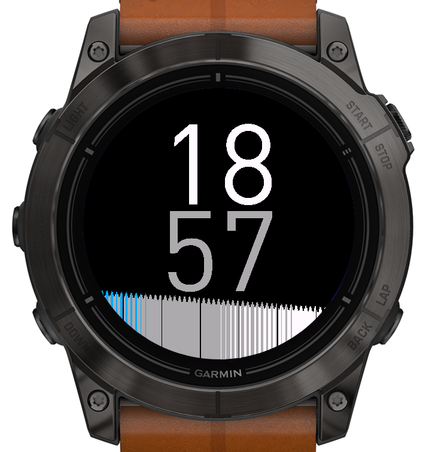

# VivoHeart Garmin IQ Watchface

<!--  -->
 
## Introduction

I've always been a big fan of how the Vivoactive HR displayed its heartrate graph. To me, past efforts felt informative, motivational, and truly earned when they appeared on my watchface. There is a special joy in seeing a large spike due to a run. The repo aims to recreate that charming style with a basic watchface to have the heartrate history visible at all times on round watches.

## Features

- Show the time
- Show 4-6 h of HR history on the main page
- Switch between multiple color schemes: White, Greyscale, Garmin, Viridis, Magma (Font and Bars independent)

## Installation Instructions

- Download from the Garmin IQ Store and you're ready to go!
- Copy the `.prg` file manually to `GARMIN\APPS` on your watch.

## Customization

Configure in Garmin Connect app or Connect IQ Store settings:
- **Font Color Scheme** – White, Greyscale, Garmin, Viridis, or Magma (time display; default: Garmin)
- **Bars Color Scheme** – White, Greyscale, Garmin, Viridis, or Magma (HR history graph; default: Garmin)
- **Bars Position** – Time on Top or Bars on Top (default: Time on Top)
- **Bars Gap** – None or Default (spacing between HR bars; default: Default)
- **Time Position** – Top or Centered (default: Centered)
- **Time Layout** – Stacked or Side by Side (default: Side by Side)
- **Minutes Color Mode** – Darker Shade or Match Hours (default: Darker Shade)

## Compatibility

Supported watches share the **454×454 round AMOLED** display:

| Device ID | Models |
|-----------|--------|
| `epix2pro51mm` | epix Pro 51 mm, D2 Mach 1 Pro, tactix 7 AMOLED |
| `approachs7047mm` | Approach S70 47 mm |
| `descentmk351mm` | Descent Mk3i 51 mm |
| `d2mach2` | D2 Mach 2 |
| `fenix847mm` | fēnix 8 47/51 mm, tactix 8, quatix 8 |
| `fenix8pro47mm` | fēnix 8 Pro 47/51 mm, quatix 8 Pro |
| `fr57047mm` | Forerunner 570 47 mm |
| `fr965` | Forerunner 965 |
| `fr970` | Forerunner 970 |
| `venu3` | Venu 3 |
| `venu445mm` | Venu 4 45 mm, D2 Air X15 |

## Screenshots

## Support

If you encounter any issues or have questions about the VivoHeart watchface, please open an issue on our [GitHub Issues page](https://github.com/r-neuschulz/VivoHeart/issues). For feature requests or contributions, feel free to submit a pull request. 

I'll occasionally check comments on the Garmin IQ Store, too.

## Acknowledgements

- thanks to [TitanicTurtle](https://apps.garmin.com/en-US/developer/b71882df-2664-4584-893a-e15a21471c4b/apps) for the guidance and support on my first steps
- shoutout to [Jim_m_58](https://forums.garmin.com/members/jim_5f00_m_5f00_58), for their continuous help and support
- appreciation to [darrencrotton/SnapshotHR](https://github.com/darrencroton/SnapshotHR) for the initial inspiration, and open sourcing their project. 